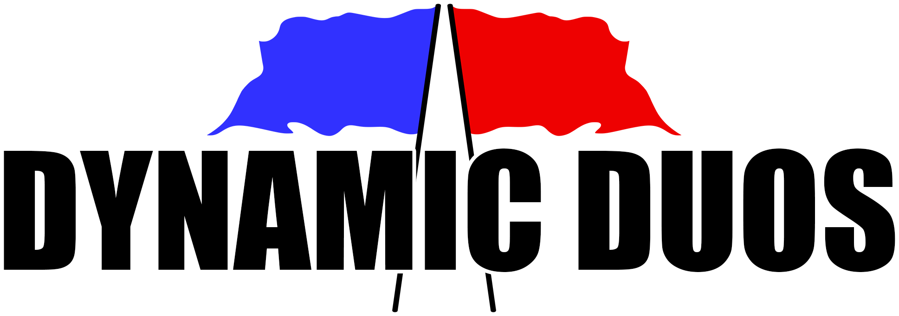

[Demo Video.](https://www.youtube.com/watch?v=JpjsJPxrqHs "Dynamic Duos Demo Video")
-

[Download Dynamic Duos for Windows.](https://stevenrice.ca/files/Dynamic%20Duos.zip "Dynamic Duos Download")
-
Simply download and extract the ZIP, open the extracted folder, and run "Dynamic Duos.exe". See [Instructions](#instructions 'Instructions') to get the game running.

# Table of Contents

- [Controls](#controls 'Controls')
- [Instructions](#instructions 'Instructions')
- [Features](#features 'Features')
  - [Level Design](#level-design 'Level Design')
  - [Weapons](#weapons 'Weapons')
    - [Hit-Scan Weapons](#hit-scan-weapons 'Hit-Scan Weapons')
    - [Projectile Weapons](#projectile-weapons 'Projectile Weapons')
  - [Effects](#effects 'Effects')
  - [Sounds and Music](#sounds-and-music 'Sounds and Music')
  - [Fully-Functioning First-Person](#fully-functioning-first-person 'Fully-Functioning First-Person')
  - [Player Visuals Syncing](#player-visuals-syncing 'Player Visuals Syncing')
  - [Heads up Display](#heads-up-display 'Heads up Display')
  - [Killer View](#killer-view 'Killer View')
  - [Droppable Flags](#droppable-flags 'Droppable Flags')
  - [Physical Lobby](#physical-lobby 'Physical Lobby')
  - [Options Menu](#options-menu 'Options Menu')
  - [Saved Preferences](#saved-preferences 'Saved Preferences')
  - [Customized Standalone Build](#customized-standalone-build 'Customized Standalone Build')
  - [Up to Twelve Players](#up-to-twelve-players 'Up to Twelve Players')
- [Assets](#assets 'Assets')
- [Details](#details 'Details')
- [Potential Lighting Issue](#potential-lighting-issue 'Potential Lighting Issue')

# Controls

| Action             | Control                             |
|--------------------|-------------------------------------|
| Move               | WASD                                |
| Look               | Mouse                               |
| Jump               | Space                               |
| Shoot              | Left Mouse Button                   |
| Switch Weapon      | Scroll Wheel and Numbers One to Six |
| Interact           | F                                   |
| Toggle Fullscreen  | `                                   |
| Open/Close Options | Escape                              |

# Instructions

- Dynamic Duos requires port forwarding of port 7777 for TCP to work.
- Ensure if prompted that you allow Dynamic Duos through your firewall or this could block your ability to connect.
- If issues are persisting, add custom firewall rules on your machine to allow port 7777 both in and out.
- If you are the host, you do not need to enter any specific address, however, you will need to share the required information with the various types of clients that are detailed next.
- Client on same machine as the host - Enter "localhost" or your IPv4 address.
- Client on another machine in your local area network - Enter your IPv4 address.
  - Windows - Go to "CMD" and enter "ipconfig" and look for "IPv4 Address".
  - Mac or Linux - Go to the terminal and enter "ifconfig" and look for "inet".
- Client on a remote network - Share your external IP which can be found by visiting a site such as [IP Chicken](https://ipchicken.com/ "IP Chicken").
  - You can also you domains as the address which can be done by setting up [No-IP Dynamic DNS Update Client](https://www.noip.com/download?page=win "No-IP Dynamic DNS Update Client").

# Features

## Level Design

- The menu, lobby, and both maps all have a consistent theme of being on a rocky moon in space.
- Consistent low-poly models means nothing seems out of place.
- Customized lighting along with a space skybox gives the feeling of being in space while ensuring high visibility.
- This setting also worked perfectly for the fast-paced and high-jumping style we wanted as it fits the low gravity one would experience on a moon.

## Weapons

- A total of six unique weapons.
- Optionally enable friendly fire, but there is no self-damage to allow for strategies such as rushing your enemies point-blank with a rocket launcher.
- Hit-scan weapons are instantaneous and have a bullet trail that fades over time.
  - These work by casting a ray from the player's camera so it lands exactly where they clicked (with some optional weapon spread).
  - Then, once the hit location is determined, the visual bullet trails are drawn coming from the barrel of the gun on all clients, giving the illusion the bullet came from the gun but in reality it fired a ray from the camera so the shot was accurate.
- Projectile weapons fire physical objects that travel over time.
- Ammo pickups for each weapon that are made of the weapon's model itself spinning and will restore maximum ammo in said weapon.
  - Similarly, given how fast-paced Dynamic Duos is, health pickups also restore full health to the player and are made of spinning medic symbols.
- Crosshair color changes to indicate if a player can shoot.
  - Green - Player can shoot.
  - Red - Player cannot shoot or is currently shooting.
- Slight delay when switching weapons before being able to shoot to ensure players plan ahead rather than to simply panic and swap to a different weapon and to ensure players cannot swap to a different gun with the other is on cooldown and then swap back.

### Hit-Scan Weapons

- Machine Gun - Low damage per shot but has a rapid fire rate with small bullet spread.
- Shotgun - Fires ten rounds in a random and large spread that deal high damage with a moderate fire rate making it deadly up close.
- Sniper Rifle - One-shot kills but along with no spread but a slow fire rate.
- Pistol - The only weapon with unlimited ammo but with low damage, low spread, and moderate fire rate.

### Projectile Weapons

- Rocket Launcher - Slow fire rate with huge explosion damage and is able to one-shot with a direct hit or a shot which lands close enough.
- Grenade Launcher - Moderate fire rate with moderate explosion damage and is able to one-shot with a direct hit or a shot which lands close enough with projectiles that are affected by gravity.

## Effects

- All weapons have an impact particle effect played.
  - Bullet impacts for hit-scan weapons.
  - Explosions for projectile weapons.
- Hit-scan weapons have bullet trails that fade over various lengths of time.

## Sounds and Music

- All weapons have unique firing and impact sounds.
- Background music.
- Sounds and music have their own individual volume sliders in the options menu.
  - Sounds and music start muted - everyone hates when you launch a game for the game and it deafens you.

## Fully-Functioning First-Person

- The local player has all its external meshes disabled and only casts shadows to ensure no camera clipping with the local player.
- A second camera which is stacked on top of the main camera renders the first-person weapons on its own so weapons will never clip into walls that are close to the player.

## Player Visuals Syncing

- The head and weapon positions of remote players are synced over the network so all players feel fluid and it is always known where they are aiming at and with what weapon.
- Player models themselves were kept simple in reference to the space crew from the game Among Us.

## Heads up Display

- Score displayed at the top of the screen.
- Current health and ammo in the currently selected weapon displayed at the bottom of the screen along with a message saying you carrying the flag when you have picked it up.
- Messages get displayed towards the center of the screen so they know what is going on in the match around them.
  - A player is killed.
  - A player has grabbed a flag.
  - A player has dropped a flag.
  - A player has returned a flag.
  - A player has captured a flag.

## Killer View

- When killed, your camera will look at the player who killed you until you respawn.
- This can allow you to relay information about the enemies to your teammates while you wait to respawn.

## Droppable Flags

- Flags are dropped when a player carrying one is killed.
- Allows for more strategy than simply automatically returning the flag to the base.

## Physical Lobby

- Lobby system allows players to move around to adjust their settings before a match.
- Buttons in the level to switch teams, toggle friendly fire, and ready up.
- See what players are on each team.
- Messages displayed to the user indicating how many players are ready to start and if there is any reason the match cannot start yet such as no players on a team.
- Automatically assign teams as players join but they are able to change teams if they wish once in the lobby.
- If a team loses all their players during a match, the game will automatically be brought back to the lobby.

## Options Menu

- Options menu able to be opened at any time in any scene.
- Allows for changing sensitivity, sound volume, and music volume.
- Allows for leaving a match.
- Allows for the host to bring a match back to the lobby.

## Saved Preferences

- Name, server address, sensitivity, sound volume, music volume, and screen size are saved so they remain when launching the game again.

## Customized Standalone Build

- Customized title of standalone build to properly display "Dynamic Duos".
- Customized icon of standalone build to be one of two flags instead of the default Unity logo.

## Up to Twelve Players

- Matches can also be played as low as one versus one.
- Even lopsided matches are possible where one team has less players than another up to a maximum six players on a team.
- All NetworkBehaviours are also setup to sync instantly and run at 128 ticks per second allowing for extremely responsive gameplay.

# Assets

- Environment - [Space Kit | Kenney](https://kenney.nl/assets/space-kit "Space Kit | Kenney")
- Weapons - [Blaster Kit | Kenney](https://kenney.nl/assets/blaster-kit "Blaster Kit | Kenney")
- Effects - [War FX | Jean Moreno (JMO)](https://assetstore.unity.com/packages/vfx/particles/war-fx-5669 "War FX | Jean Moreno (JMO)")
- Sounds - [Free Sound Effects Pack | Olivier Girardot](https://assetstore.unity.com/packages/audio/sound-fx/free-sound-effects-pack-155776 "Free Sound Effects Pack | Olivier Girardot")
- Music - [Space Threat (Free Action Music) | Muz Station Productions](https://assetstore.unity.com/packages/audio/music/space-threat-free-action-music-205935 "Space Threat (Free Action Music) | Muz Station Productions")
- Skybox - [Starfield Skybox | PULSAR BYTES](https://assetstore.unity.com/packages/2d/textures-materials/sky/starfield-skybox-92717 "Starfield Skybox | PULSAR BYTES")

# Details

- Created using Unity 2020.3.25f1.
- Project setup using the [Universal Render Pipeline](https://unity.com/srp/universal-render-pipeline "Universal Render Pipeline").
- Project setup using Unity's [Input System](https://docs.unity3d.com/Packages/com.unity.inputsystem@1.1/manual/index.html "Input System").
  - Inputs are configured to be handled in Update as seen in "Edit > Project Settings > Input System Package > Update Mode > Process Events in Dynamic Update".
  - Input bindings are setup by navigating in to the project window and selecting "Assets > Settings > Input Actions" and then clicking "Edit asset" in the inspector panel.
  - A "Player Input" component is attached to the "Game Manager" prefab with "Actions" set to the "Input Actions" asset from the last bullet point, with "Behaviour" set to "Send Message" which sends inputs to methods found in "GameManager.cs" that is also attached to the "Game Manager" prefab.
- User interfaces were setup using the new [UI Builder](https://docs.unity3d.com/2021.2/Documentation/Manual/UIBuilder.html "UI Builder") which is now included in Unity 2021.2 as a stable package and will be in Unity 2021 LTS (Unity 2021.3), but, it is still listed as a preview package under Unity 2020 LTS.
  - Related to [UI Builder](https://docs.unity3d.com/2021.2/Documentation/Manual/UIBuilder.html "UI Builder") being new, in the editor some warnings may appear in the console related to "FocusController". This is not a script this project created and is related to [UI Builder](https://docs.unity3d.com/2021.2/Documentation/Manual/UIBuilder.html "UI Builder"). This is just behaviour related to the package being in preview interacting with the Unity editor where "focus" is shifted from the game view to other panels in the editor and vice versa, but, it is not related to our code implementation. These warnings are not triggered in standalone builds anyways, making it only a Unity editor issue with the package.

# Potential Lighting Issue

- When playing in the editor, Unity will often fail to properly render realtime lighting when loading a scene that play mode was not initially launched in. For instance, if in the editor, you start at the menu and click to play the game from there, the lighting in the dungeon levels will likely appear broken.
- If this is occuring, simply build the game as this issue does not exist in standalone builds.